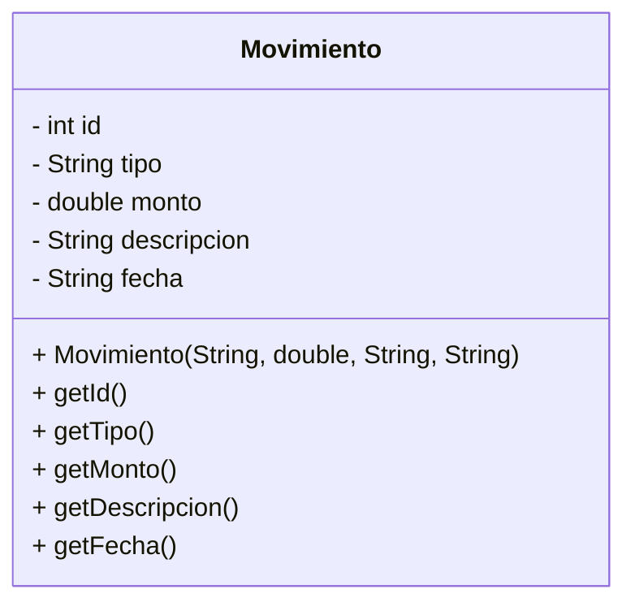

# Diagrama de Clases

```mermaid
classDiagram
    class Movimiento {
        - int id
        - String tipo
        - double monto
        - String descripcion
        - String fecha
        + Movimiento(String, double, String, String)
        + getId()
        + getTipo()
        + getMonto()
        + getDescripcion()
        + getFecha()
    }
```
